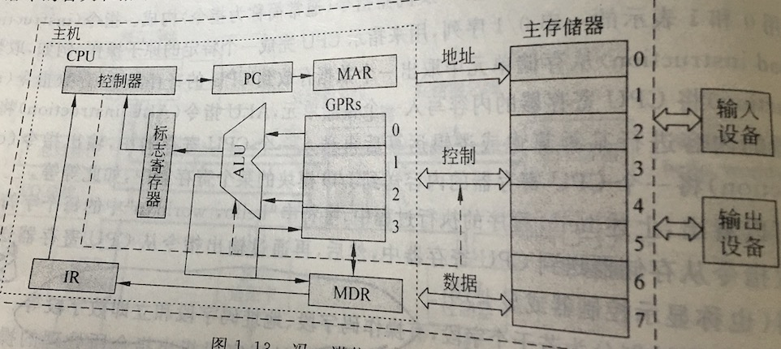
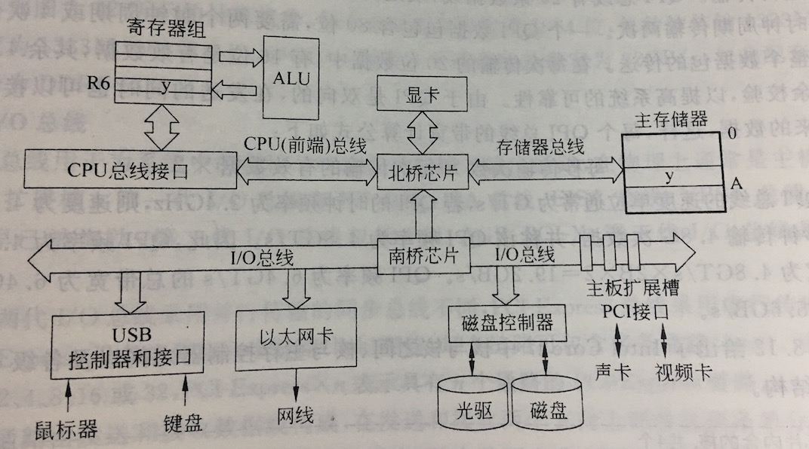

# 前
* 计算机内存中，最小的存储单位是“位(bit)”
* 8个位(bit)构成一个字节(byte)
* 字节是内存的基本单位，也是编址单位
* 16位的计算机 两个字节称为一个字
* 一个字有几个字节构成和计算机的型号有关，例如，32位计算机中，一个字就是四个字节

# character 1 计算机系统概述
* 冯·诺伊曼结构的基本思想
    * 采用存储程序的工作方式
    * 计算机由运算器、控制器、存储器、输入设备和输出设备5个基本部件构成
    * 存储器不仅能存放程序，而且也能存放指令，形式上数据和指令没有区别，但计算机应能区分他们两控制器应能让控制指令的自动执行，运算器能进行基本的算数运算；操作人员可以通过输入输出设备使用计算机
    * 计算机内容以二进制形式表示指令和数据，每条指令由操作码和地址码两部分组成
* CPU主要组成部件
    * 数据通路，主要包含算数逻辑部件和通用寄存器
    * 控制器，对指令进行译码，生成对应的控制信号，以控制数据通路正确的进行操作
* 存储器分为内存和外存
* 汇编程序：也称汇编器，用来将汇编语言源程序翻译成机器语言目标程序
* 解释程序：也称解释器，用来将源程序中的语句按其执行顺序逐条翻译成机器指令并立即执行
* 编译程序，也称编译器，用来将高级语言源程序翻译成汇编语言或机器语言目标程序
* 机器语言程序所运行的计算机硬件和软件之间需要一个“桥梁”，这个在软件和硬件之间的界面就是指令集体系结构(ISA)
* C语言，从源程序到可执行程序
    * 预处理阶段，预处理程序(cpp)对源程序中以字符#开头的命令进行处理，预处理程序输出结果还是一个源程序文件，以i为扩展名
    * 编译阶段，编译程序(ccl)对预处理后的源程序进行编译，生成一个汇编语言源程序文件，以s为扩展名
    * 汇编阶段，汇编程序(as)对汇编语言源程序进行汇编，生成一个可重定位目标文件，以o为扩展名。它是一种二进制文件，其中的代码已经是机器指令。
    * 链接阶段，链接程序(ld)将多个可重定位目标文件盒标准库函数合并成为一个可执行目标文件(exe文件)

* 过程
    * 根据PC取指令到IR
    * 指令译码并送出控制信号
    * 取操作数
    * 指令执行
    * 回写结果
* 计算机性能的定义：
    * 吞吐量，表示在单位时间内完成的工作量，也被称为带宽
    * 响应时间，执行时间/等待时间，是指从作业提交开始到作业完成所用的时间
* CPU时间是值CPU用于程序执行的时间
    * 用户CPU时间，指真正用于运行用户程序代码的时间
    * 系统CPU时间，指为了执行用户程序而需要CPU运行操作系统程序的时间
* CPU性能是指用户CPU时间，它只包含CPU运行用户程序代码的时间
* 时钟周期，计算机执行一条指令的过程被分成若干步骤和对应的动作来完成，每一步动作都要由相应的控制信号进行控制。因此CPU必须能够产生同步的时钟定时信号，也就是CPU的主脉冲信号，其宽度称为时钟周期。
* 时钟频率，CPU的主频就是CPU中的主脉冲信号的时钟频率，是CPU时钟周期的倒数。
* CPI，表示执行一条指令所需时钟周期数。对于一条特定指令而言，其CPI指执行该条指令所需要的时钟周期数，此时CPI是确定值。但是对于一个程序和一台机器来说，CPI是指该程序或该机器指令集中的所有指令执行所需的平均时钟周期数。
    `CPU执行时间=CPI*程序总指令条数*时钟周期`

# character 2 数据的机器级表示
* 后缀字母标识该数的进位记数制
    * B表示二进制
    * O表示八进制
    * D表示十进制
    * H表示十六进制q
# character 4 指令系统
* 计算机的指令有微指令、机器指令和伪指令之分，微指令属于硬件范畴，伪指令属于软件范畴，机器指令介于两者之间，一般是指机器指令。
* ISA:指令集体系结构
* “冯诺伊曼结构计算机“的思想，计算机的程序一旦被启动运行，则必须能够自动地逐条从主存取出指令执行
* 一条指令中必须明确的包含的信息：
    * 操作码，指定操作的类型
    * 源操作数或其地址，指出一个或多个源操作数或其所在的地址，可以是主存地址、寄存器编号、I／O端口，也可以是指令中直接给出一个立即数
    * 结果的地址，记过所存放的地址，可以是主存地址、寄存器编号、I/O端口
    * 下一条指令地址，下一条指令存放的地址，可以是主存地址
* 常用的寻址地址
    * 立即寻址，在指令中直接给出操作数本身，这种操作数称为立即数
    * 直接寻址，指令中给出的地址码是操作数的有效地址，这种地址称为直接地址或绝对地址
    * 间接寻址，指令中给出的地址码是存放操作数有效地址的主存单元地址
    * 寄存器间接寻址，指令中给出的地址码是一个寄存器编号，该寄存器中存放的是操作数的有效地址
    * 变址寻址，主要用于对线性表之类的数组元素进行方便的访问
    * 相对寻址
    * 基址寻址
* 移位指令：
    * 算术左移：操作数的各位依次向左移动，低位补零
    * 算术右移：各位依次向右移动，高位补符号位。
    * 逻辑左移：同算术左移
    * 逻辑右移：各位依次向右移，高位补零
* 常用的标志信息
    * 零标志 ZF
    * 溢出标志 OF
    * 符号标志 SF
    * 进位／借位标志 CF
* X-Y = X + Y' + 1 在运算器中减法的操作
* 目前，通用寄存器型指令占据主导地位，主要因为：
    * 通用寄存器和处理器集成在一起，作为ALU的操作数来源，可以缩短传输延迟。
    * 寄存器位于存储器层次化结构的顶端，速度快且容易使用。
* 汇编语言是与机器语言一一对应的符号化表示语言
* MIPS是32位鼎昌指令字，操作码字段也是固定长度。
* MIPS指令格式只有3种：
    * R型指令         
    OP(31-26)rs(25-21)rt(20-16)rd(15-11)shamt(10-6)func(5-0)
    * I型指令

        OP(31-26)rs(25-21)rt(20-16)立即数(15-0)
    * J型指令

        OP(31-26)直接地址(25-0)
        
* R型指令是RR型指令，其操作码OP为000000，操作类型由func字段指定，若是双目运算类指令，则rs和rt的内容分别作为第一和第二源操作数，结果送rd；若是移位指令，则对rt的内容进行移位，结果送rd，所移位数由shamt字段给出
* I型指令是立即数型指令，若是双目运算类指令，则将rs的内容和立即数分别作为第一和第二源操作数，结果送rt，若为load/store指令，则将rs和立即数符号扩展后的内容相加作为内存单元地址,Load指令将内存单元内容送rt，store指令会将rt内容送内存单元，如果是跳转指令的话，会根据rs，rt的内容来判断是否要进行跳转 * J型指令主要是无条件跳转指令，将当前的pc的高4位拼上26位直接地址，最后添2个0就可以得到32位的跳转目标方式。

# character 5 中央处理器
* 专门用来执行指令的部件就是中央处理器(CPU)
* 在CPU种控制指令执行的部件是控制器
* 指令按照顺序存放在内存连续单元中，指令地址由PC给出。
* 指令周期：CPU取出并执行一条指令的时间称为指令周期
* 指令执行过程：
    * 取指令并计算下一条指令地址
    * 对指令操作码译码
    * 计算源操作数地址并取源操作数
    * 数据操作
    * 目的操作数地址计算并存结果

    上述过程的前两步所有的指令都一样，对于后3步，完全由第二步译码得到的控制信号控制。

* 寄存器传送语言(RTL) 规定如下：
    * 用R[r]表示寄存器堆中寄存器r的内容
    * 用M[addr]表示读取存储单元addr的内容
    * 传送方向用<-表示，传送源在右，传送目的在左
    * 程序计数器PC直接用PC表示其内容
* 通常将指令执行过程中数据经过的路径，包括路径上的部件称为数据通路
* 数据通路中专门进行数据运算的部件称为执行部件，数据通路由控制部件进行控制
* 程序计数器，用来存放指令的地址
* 指令寄存器，用来存放现行指令
* 指令译码器，对指令寄存器中的操作码部分进行部分解析，产生对应的译码信号提供给操作控制信号形成部件
* 脉冲源及启停控制信号，脉冲源产生一定频率的脉冲信号作为整个机器的始终脉冲，是CPU时序的基准信号。启停线路需要时能够保证可靠地开放和封锁时钟信号
* 时序信号产生部件，以时钟脉冲为基础，产生不同指令对应的周期、节拍、工作脉冲等时许信号
* `beq rs,rt,imm16`做减法以比较rs和rt中内容的大小，并计算下一条指令地址，然后根据比较结果修改PC，转移目标地址采用相对寻址，基准地址为下一条指令地址(PC+4)，位移量为立即数imm16经符号扩展后的值的4倍
* 控制器分成主控制器和局部ALU控制器两部分。主控制器的输入为指令操作码op，输出各种控制信号，并根据指令所设计的ALU运算类型产生ALUop，同时生成一个R-型指令的控制信号R-type，用来控制选择将ALUop输出作为ALUctr信号，还是根据R-型指令中的func字段来产生ALUctr信号。因此，R-型指令时R-type==1,非R-型指令时R-type==0;
* 计算机性能由3个关键性因素决定：指令数目、时钟周期、CPI。指令数目由编译器和指令集所决定的，时钟周期和CPI由处理器的设计与实现决定
* CPU会遇到一些特殊情况而无法继续执行当前程序，主要分为两大类：
    * 内部异常，是指由处理器内部异常引起的意外事件
        * 故障，也称为失效，在引起故障的指令启动后、执行结束前被检测到的一类异常事件
        * 自陷，也称为陷进或陷入，与故障等其他意外发生的异常事件不同，这是预先安排的一种“异常”事件，首先通过某种方式将CPU设定为处于某个特定状态在程序执行过程中，一旦某条指令的执行发生了相应状态所满足的条件，则CPU调出特定的程序进行相应的处理
        * 终止，如果在执行指令过程中发生了使机器无法继续执行的硬件故，线路故障、断电等，则程序无法继续执行，只好终止。
        
    * 外部中断，程序执行过程中，若外设完成任务或发生某些特殊事件，会向CPU发中断请求，要求CPU对这些情况进行处理。通常，每条指令结束后，CPU都会主动去查询是否有终端请求，有的话，则将下一条指令地址作为断点保存，然后转到相应的中断服务程序执行，结束后再回到断点继续执行
    
* 异常处理过程：
    * 保护端点和程序状态
    * 识别异常事件并转异常处理

# character 6 指令流水线
上章中单周期处理器的指令执行都是采用串行方式。串行方式下，CPU总是在执行完一条指令后才取出下一条指令执行。这种串行方式并没有充分利用执行部件的并行性，所以指令的执行效率低。为了提高执行效率，可以采用流水线额方式，让多条指令的执行相互重叠起来。

* 一条指令流水线有以下5个流水段组成
    * 取指令(IF) 从cache或主存中取指令
    * 指令译码(ID) 产生指令执行所需的控制信号
    * 取操作数(OF) 读取存储器中操作数或寄存器操作数
    * 执行(EX) 对操作数完成指定操作
    * 写回(WB) 将操作数写回存储器或寄存器

* 流水线设计的原则，指令流水段个数以最复杂指令所用的功能段个数为准，流水段的长度以最复杂的操作所花时间为准。若流水段数为M，每个流水段的执行时间为T，则N条指令的执行总时间为(M+N-1)*T
* 适合流水线的指令集特征
    * 指令长度应尽量一致
    * 指令格式应尽量规整
    * 采用装入／存储型指令风格，可以保证除了Load/Store指令外的其他指令都不访问存储器
* 指令流水线中，可能会遇到一些情况使得流水线无法正确执行后续指令而引起流水线的阻塞/停顿,这种现象叫做流水线冒险。有结构冒险，数据冒险，控制冒险。
* 结构冒险也称为硬件资源冲突，引起结构冒险的原因在于同一个部件同时被不同指令所用，也就是说它是由硬件资源竞争造成的
* 数据冒险也称为数据相关，引起数据冒险的原因在于后面指令用到前面指令结果时前面指令结果还没有产生
    解决措施：
    * 插入空操作指令，在软件上采取措施，使相关指令延迟执行
    * 插入气泡，使相关指令延迟执行，通过硬件阻塞方式阻止后续指令执行 
    * 采用转发技术，将数据通路中生成的中间数据直接转发到ALU输入端

# character 7 存储器分层体系结构
* 存储器的分类：
    * 按存储元件分类，存储元件必须具有两个截然不同的物理状态，才能被用来表示二进制代码0和1.目前的材料有半导体器件（半导体存储器），磁性材料（磁表面存储器），光介质（光盘存储器）。
    * 按存储方式分类
        * 随机存取存储器（RAM），按照地址访问存储单元，每个单元的访问时间是一个常数。半导体存储器属于随机存取存储器，可以作cache和主存储器
        * 顺序存取存储器（SAM），信息按顺序存放和独处，其存取时间取决于信息存放位置，已记录块为单位编址。磁盘存储器是顺序存储器
        * 直接存取存储器（DAM），兼有随机访问和顺序访问的特点，首先可以直接选取所需信息所在区域，然后按顺序方式存取
        * 相联存储器，按内容检索到存储位置进行读写，这种存储器称为按内容访问存储器。
    * 按信息的可更改性分类，分为读写存储器和只读存储器，RAM芯片是一种读写存储器，只读存储器用ROM表示，ROM芯片中的信息一旦确定，通常情况下是只读不写，都是菜油随机存取方式进行信息的访问
    * 按断电后信息的可保存性分类，分为非易失性存储器和易失性存储器
    * 按功能分类
        * 高速缓冲存储器，目前高速缓存(cache)由静态RAM芯片组成，位于主存和CPU之间，存取速度接近CPU的工作速度，用来存放当前CPU经常使用到的指令和数据
        * 主存储器，指令直接面向的存储器是主存储器，简称主存。CPU执行指令时给出的存储器地址是主存地址，在虚拟存储系统中，需要将指令给出的逻辑地址转换成主存地址。。因此，主存是存储器分层体系结构中的核心存储器，用来存放系统中被启动运行的程序及其数据。
        * 辅助存储器，系统运行时直接和主存交换信息的存储器。大多数磁盘存储器作为辅存，辅存的内容需要调入主存后才能被CPU访问
        * 海量后备存储器，主要用于信息的备份和脱机存档
    
        辅存和海量后备存储器统称为外部存储器，简称外存
    
    * 主存储器的组成和基本操作
        * 一个个存储0/1的记忆单元构成的存储阵列式存储器的核心部分，这种记忆单元也称为存储元、位元。存储阵列也被称为存储体、存储矩阵。为了存取存储体中的信息，必须对存储单元编号，所谓号码就是地址。
        * P237
        * 指令执行过程中需要访问主存诗，CPU首先把被访问单元的地址送到主存地址寄存器(MAR)，然后会通过地址线将主存地址送到主存中的地址存储器，以便主存中的地址译码器选中相对应单元，同时，CPU将读写控制信号通过控制线送到主存的读写控制电路。如果是写操作，CPU同时将读写的数据送主存数据寄存器(MDR)，在读写控制电路的控制下，通过数据线写入选中的单元。如果是读操作，则主存读出选中单元的内容送数据线，然后被送到MDR中。
        * 存储周期是指存储器进行一次读写操作所需要的全部时间，也就是存储器进行连续读写操作所允许的最短时间间隔
    * 存储器的层次化结构
        * 寄存器
        * 高速缓存(cache)
        * 主存储器(RAM ROM)
        * 辅助存储器(硬盘)
        * 海量后备存储器(磁带库、光盘库)
        
        数据一般只在相邻两层之间复制传送，而且总是从慢速存储器复制到快速存储器被使用。传送的单位是一个定长块。
        CPU执行指令的时候，需要的操作大部分来自寄存器，如果需要从主存器中取数据，回先放回cache->主存->硬盘
    
    * SRAM存储元件
        * 
        * 所用MOS管多，占硅片面积大，功耗大，集成度第。
        * 因为采用一个正负反馈触发器电路来存储信息，所以只要直流供电电源一直加在电路上，就能一直保持记忆状态不变，无需刷新
        * 不会因为读操作而造成状态发生改变，无需读后再生
        * 读写速度快，常用于cache
    * DRAM存储元件：
        * 所用MOS管少，占硅片面积小，因而功耗小，集成度很高
        * 采用电容储存电荷来存储信息，会发生漏电现象，需要定时刷新
        * 读操作会使得状态发生改变，故需读后再生
        * 读写速度慢，常用于做主存
* CPU 通过其芯片内的总线接口部件(即总线控制逻辑)与系统总线(是对连接CPU、存储器和各种IO模块等主要部件的总线的统称，二Intel公司推出的芯片组中，系统总线特指CPU连接到北桥芯片的总线，也称为处理器总线或前端总线)相连，然后通过总线之间的I/O桥接器、存储器总线连接到主存
* 总线是连接其上的各部件共享的传输介质，通常总线由控制线、数据线和地址线构成。
* CPU和主存之间交换信息时，CPU通过总线接口部件把地址信息和总线控制信息分别送到地址线和控制线，CPU和主存之间交换的数据则是通过数据线传输，每一根数据线传送以为数据，因为数据线的条数就是数据线的位宽
* 现在的计算机中可以有多条存储器总线同时进行数据传输，支持两条总线同时进行传输的内存条插槽为双通道内存插槽，还有三通道、四通道内存插槽，其总线的传输带宽可以分别提高到单通道的2、3、4倍
* 存储器芯片的扩展
    * 位扩展， 由若干片位数较少的存储器芯片构成给定字长的内存条时，需要进行位扩展。eg:用8片4096*1位的芯片构成4K\*8位的内存条，需要在位方向上扩展8倍，而自方向上不需要扩展。(纵向扩展)
    * 字扩展，字扩展是容量的扩充，位数不变(横向扩展)
    * 字、位同时扩展，同时扩展
* 半导体Flash存储器也称为闪存，是高密度非易失性读写存储器，兼有RAM、ROM的优点，功耗低，集成度高，不需要后备电源

## 高速缓冲存储器
* 缓解CPU和主存之间的速度匹配问题的方法：
    * 提高存储芯片本身的速度
    * 采用并行存储器结构
    * 在CPU和主存之间设置高速缓存(cache)
* 程序访问的局部性
    * 时间局部性，被访问的某个存储单元在一个较短的时间间隔内很可能又被访问
    * 空间局部性，被访问的某个存储单元的临近单元在一个较短的时间间隔内很可能也被访问
* 为了更好的利用程序访问的空间局限性，通常把当前访问单元以及邻近单元作为一个主存块一起调入cache，这个主存块的大小以及程序对数组的访问顺序等都对程序的性能有一定的影响
* 空间局部性对于单个变量来说是没有意义的
* cache的工作原理，cache是一种小容量高速缓冲存储器，由快速的SRAM组成，直接制作在CPU芯片内，速度几乎与CPU一样快，在CPU和主存之间设置cache，总是把主存中被频繁访问的活跃程序块和数据块复制到cache中。

    为了便于cache和主存键交换信息，cache和主存空间都被划分为相等的区域。主存中的区域称为块(block)称为主存块，它是cache和主存之间的信息交换单位；cache中存放一个主存块的区域被称为行或槽，因此，主存块大小等于cache行中数据区大小
    
    * cache的有效位，说明cache行中的信息是否有效，每个cache行都需要一个有效位，有了有效位，可以通过有效位清零来淘汰某cache行中的主存块，称为冲刷，装入一个新主存块时，再使有效位置为1
    * CPU在cache中的访问过程，CPU执行程序过程中，需要从主存取指令或读数据时，先检查cache中有没有要访问的信息，若有，就直接从cache中读取，而不用访问主存储器，若没有，再从主从中把当前访问信息所在的一个主存块复制到cache中，因此cache中的内容时主存中部分内容的副本
    * CPU在cache-主存层次的平均访问时间为：Ta = P * Tc + (1-p)*(Tm+Tc) (p为命中率，Tc是直接存取信息所用的时间开销，Tm表示主存访问时间即从主存中拂去一个主存块送cache，并同时将所需信息送CPU)
* cache行与主存块之间的映射方式，在将主存块复制给cache行时，主存块和cache行之间必须遵循一定的映射规则。CPU要访问某个主存单元时，可以依据映射规则，到cache对应的行中查找要访问的信息，而不用在整个cache中查找
    * 直接映射，每个主存块和cache的固定行中
      **cache行号 = 主存块号 mod cache 行数**
      在cache中，给每一个行设置一个t(m-c)位长的标记(tag),m表示主存块号位，c表示cache行数位
      主存地址分成了3部分**标记(高t位)、cache行号(中间c位)、块内地址(剩下的地位地址)**
      访存过程：首先根据访存地址中间的c位，直接找到对应的cache行，将对应cache行中的标记和主存地址的高t位标记进行比较，若想等并有效位为1，则cache“命中”,此时，根据主存地址中低位的块内地址，在对应的cache行中存取信息，若不相等或者有效位为0，则“缺失”，此时cpu从主存中读取该地址所在的一块信息送到对应的cache行中，将有效位置置1，并将标记位置为地址中的高t位，同时将该地址中的内容送CPU
      **直接映射的优点是容易实现，命中时间短，但由于多个块号"同余"的内存块智能映射到同一个cache行，当访问集中在"同余"内存块时，就会引起频繁的调进调出，即使其他的cache行都空闲，也毫无帮助**
      
    * 全相联映射，每个主存块映射到cache的任意行中
      全相联映射cache中，每行的标记用语指出该行取自主存的那个块，因为每一个主存块可能在任意一行中，所以需要比较所有cache行的标记，因此主存地址中无需cache行索引，只有标记和块内地址两个字段。
      访存过程：首先根据访寸地址中的高t位标记与cache中每个行的标记进行比较，若有一个相等并且对应有效位为1，则命中，此时CPU根据块内地址从该行中取出信息；若都不相等，则不命中，此时，需要将主存地址单元中所在的主存块复制到cache的任何一个空闲行中，并置有效位为1，置标记位位前t位地址
      时间开销和所用元件开销都较大，实现起来比较困难，不适合大容量的cache
      
    * 组相联映射，每个主存块映射到cache固定组的任意行中，将cache所有行分成2\^q个大小相等的组，每组有2\^s行。每个主存块被映射到cache固定组中的任意一行，即组相联采用组间模映射、组内全映射的方式即s=1为2路组相联。通过对主存号取模，使得每个2\^q个主存块与2\^q个cache组一一对应，主存地址空间实际上被分成了若干组群，每个组群中有2\^q个主存块对应cache的2\^q个组。假设主存地址有n位，块内地址k位，有2\^m个组群，则n=m+q+k,
        
        | 标记 | cache组号 | 块内地址 |
        | --- | --- | --- |
        
        m位为标记，中间q位为组号，剩下的k位为块内地址

        `cache组号 = 主存块号 mod cache 组数`
        如此设置的2\^q组*2\^s行/组的cache映射方式称为2\^s路组相联映射，
        s的选取决定了块冲突的概率和相联比较的复杂性。s越大，则cache发生块冲突的概率越低，相联比较电路越复杂，选取适当的s，可使组相联映射的成本比全相联的低得多，而性能上仍可接近全相联方式
        访存过程：首先根据访存地址中间的q位cache组号，直接找到对应的cache组，将对应cache组中每个行的标记与主存地址的高m位标记进行比较，若有一个相等并有效位为1，则访问cache命中，此时根据主存地址中的块内地址，在对应cahce行中存取信息，若不相等或虽相等但有效位为0，则不命中，此时CPU从主存中读出该地址所在的一块信息送到cache对应组的任意一个空闲行中，将有效位置1，并设置标记，同时将该地址中的内容送CPU
    
    * 关联度，指一个主存块映射到cache中时可能存放的位置个数，因此，直接映射的关联度最低，为1；全相联映射的关联度最高，为cache的总行数；N路组相联映射的关联度居中为N
    * cache、主存大小一定，关联度和命中率、命中时间、标记所占额外开销等有如下关系：
        * 关联度越低，命中率越低
        * 关联度越低，判断是否命中的开销越小，命中时间越短
        * 关联度越低，标记所占额外空间开销越少

* cache中主存块的替换算法
    * 先进先出算法(FIFO),总是选择最早装入cache的主存块呗替换，这种算法实现起来较方便，但是不能正确反映程序的访问局部性，因为可能最先进入的主存块也可能是目前经常要用的。
    * 最近最少用算法(Least-Recently Used)，总是选择近期最少使用的主存块被替换。算法原理：
        1. 新数据插入到链表头部；
        2. 每当缓存命中（即缓存数据被访问），则将数据移到链表头部；
        3. 当链表满的时候，将链表尾部的数据丢弃。
    
        LRU算法的实现是在每个cache行有一个计数器，用计数器来记录主存块的使用情况，通过硬件修改计数值，并根据计数值选择淘汰某个cache行中的主存块。淘汰时只要将有效位置0，这个计数器的值叫做LRU位，其位数与cache组大小有关。计数器的变化规则如下:
        * 命中时，被访问的行的计数器清零，比其低的计数器加1，其余不变
        * 未命中且该组还有空闲行时，则新装入的行的计数器设为0，其余加1
        * 未命中且该组无空闲行时，计数值为3的那一行中的主存块被淘汰，新装入的行的计数器设为0，其余加1.
    * 最不经常用算法(Least-Frequently used)，替换cache中引用次数最少的块，LFU也用与每个行相关的计数器来实现
    * 随机替换算法，从候选行的主存块中随机选取一个淘汰，与使用情况无关。

* cache中的一致性问题
    * 因为cache中的内容是主存块副本，所以当对cache中的内容进行更新时，就存在对cache和主存如何保持一致的问题
    * 当多个设备都允许访问主存时
    * 当多个CPU都带有各自的cache而共享主存时
* 解决cache一致性问题的两种写操作
    * 全写法，写操作时，若写命中，则同时写cache和内存；若写不命中，则：
        * 写分配法，先在主存块中更新相应存储单元，然后分配一个cache行，将更行后的主存块装入到分配的cache行中。利用了空间局部性，但是每次写不命中都要从主存中读取一个块到cache中，增加了读主存块的开销
        * 非写分配法，仅更新主存单元而不装入主存块到cache中，这种方式可以减少读入主存块的时间，但是没有利用空间局部性

        这种方法会使的增加写操作的开销，为了减少写主存的开销，通常在cache和主存之间加一个写缓冲(write buffer).在CPU写cache的同时，也将信息写入写缓冲，然后由存储控制器将写缓冲中的内容写主存。写缓冲是一个FIFO队列，一般由4项，在写操作频率不是很高的情况下，因为CPU会将信息写入快速的写缓冲而无须写慢速的主存，因而效果更好。但是如果写操作频繁，则会使写缓冲饱和和阻塞
    * 回写法，当CPU执行写操作时，若写命中，则信息只被写入cache而不被写入主存，若写不命中，则在cache中分配一行，将主存块掉入该cache行中并更新相应的单元的内容。

# character 8 互连及输入输出组织
* 输入输出组织主要用于控制外设与内存、外设与CPU之间进行数据交换。它是计算机系统中重要的软、硬件结合的子系统。
* 输入输出系统：通常把外部设备及其接口线路、I/O控制部件以及I/O软件
* 外设的分类：
    * 按信息的传输方向：
        * 输入设备
        * 输出设备
        * 输入输出设备
    * 按功能分类：
        * 人机交互设备
        * 存储设备
        * 机-机通信设备
* 外设的特点：
    * 异步性
    * 实时性
    * 多样性
* 常用的输入设备：键盘和鼠标；常用的输出设备：打印机和显示器。
* 磁表面存储器中信息的存取主要由磁层和磁头来完成。`磁层`是存放信息的介质，`磁头`是实现磁-电和电-磁转换的元件
* 磁表面存储器的读写过程
 
  一般都使磁头固定，而磁层作高速回转或匀速直线运动，在这种相对运动中，通过磁头进行信息存取

* 磁表面存储器的性能指标
    * 记录密度，记录密度可以通过道密度和位密度来表示，磁道是磁层运动方向上被磁头扫过的轨迹。一个磁表面会有许多磁道。在沿磁道分布方向上，单位长度内的磁道数目叫做道密度。在沿磁道方向上，单位长度那存放的二进制信息的数目叫位密度
    * 存储容量，存储容量是指整个存储器所能存放的二进制信息量
    * 平均存取时间。存取时间包括磁头定位和数据传输等多个部分的时间
    * 数据传输速率，磁表面存储器完成磁头定位和旋转等待以后，单位时间内从存储介质上读出或写入的二进制信息量
* 硬盘存储器
    * 磁道：磁头和盘片相对运动形成的圆
    * 柱面：多个盘片上相同磁道所形成
    * 信息存储在盘面的磁道上，而每个磁道被分成若干扇区，在读写磁盘时，总是写完一个柱面上的所有磁道后，再移到下一个柱面。
    * 磁道从外向里编址，最外的磁道为0
    * 磁盘读写
        * 寻道操作：硬盘控制器把磁盘地址送到磁盘驱动器的磁盘地址寄存器后，便产生寻道命令，启动磁头定位伺服系统进行磁头定位操作。完成后，发出寻道结束信号给磁盘控制器，并转入旋转等待操作
        * 旋转等待操作：盘片旋转时，索引标志产生的脉冲将扇区计数器清零，以后每来一个扇区，加1，把计数内容与磁盘地址寄存器中的扇区地址进行比较。符合，就输出扇区符合信号
        * 读写操作
    * 硬磁盘的主要技术指标
        * 未格式化容量计算方法`磁盘总容量=记录面数*理论面数*内圆周长*位密度`
        * 格式化后的实际容量`磁盘实际容量=2*盘片数*磁道数/面*扇区数/磁道*512B/扇区（记录面数通常约为盘片数的两倍）`    
        * 数据传输率=`每分钟转速/60*内圆周长*位密度`
        * 响应时间=`寻道时间+旋转等待时间+数据传输时间` 

 ## 外设与CPU、主存的互联

* 互联结构：连接各部件的通路的集合
* 互联方式：
    * 分散连接：各部件之间通过单独的连线互连
    * 总线连接：将多个部件连接到一组公共信息传输线上
* 总线是计算机内数据传输的公共路径，用于实现两个或两个以上部件之间的信息交换。
* 总线
    * 内部总线：芯片内部连接各元件的总线
    * 系统总线：连接CPU、存储器和各种I/O模块等主要部件的总线(通常说的总线就是这种)
* 系统总线
    * 控制线，用来控制对数据线和地址线的访问和使用
    * 数据线，用来承载在源部件和目的部件之间传输的信息
    * 地址线，用来给出源数据或目的数据所在的主存单元或I/O端口的地址
* 总线的性能指标
    * 总线宽度，总线中数据线的条数称为总线宽度，它决定了每次能同时传输的信息的位数
    * 总线工作频率，一个时钟周期内发送的数据次数
    * 总线带宽，总线在进行数据传输时单位时间内最多可传输的数据量`B=W*F/N`,W表示总线宽度，F为总线的时钟频率，N为完成一次数据传送所用的时钟周期数
    * 总线寻址能力，由地址线位数所确定的可寻址地址空间的大小
    * 总线定时方式，同步通信、异步通信、半同步通信
    * 总线传送方式
    * 总线负载能力
* 基于总线的互连结构
    
    * 北桥是一个主存控制器集线器芯片，本质上是一个DMA控制器（DMA既可以指内存和外设直接存取数据这种内存访问的计算机技术）
    * 南桥是一个I/O控制器集线器芯片，其中可以集成USB控制器、磁盘控制器、以太网控制器等各种外设控制器。
    * CPU与主存之间由处理器总线和存储器总线相连。各类I/O设备通过相应的设备控制器连接到总线上，而I/O总线通过芯片组与主存和CPU连接
    

