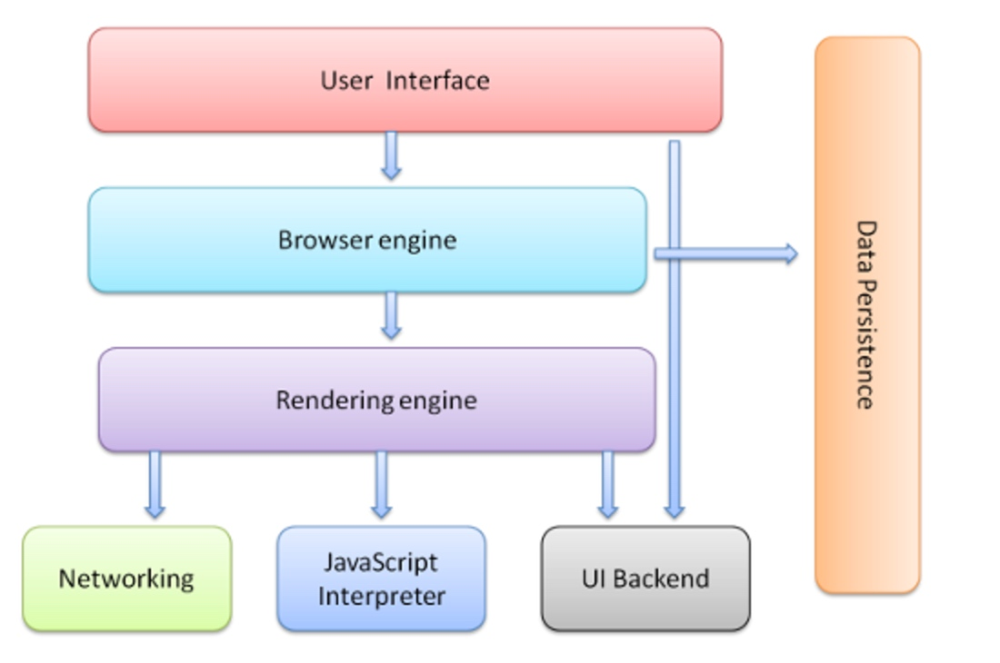
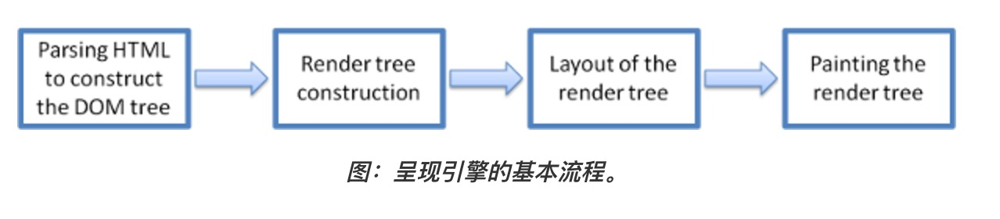
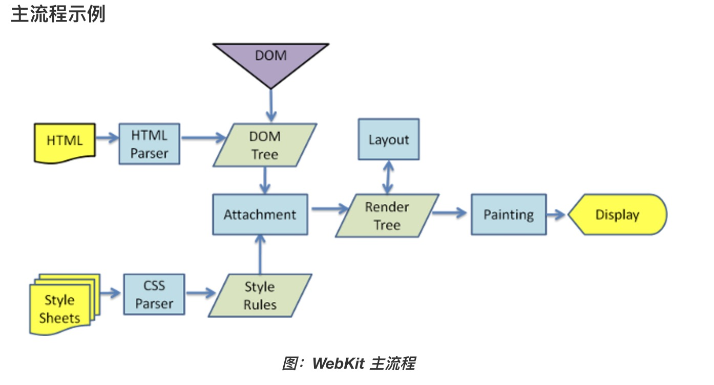
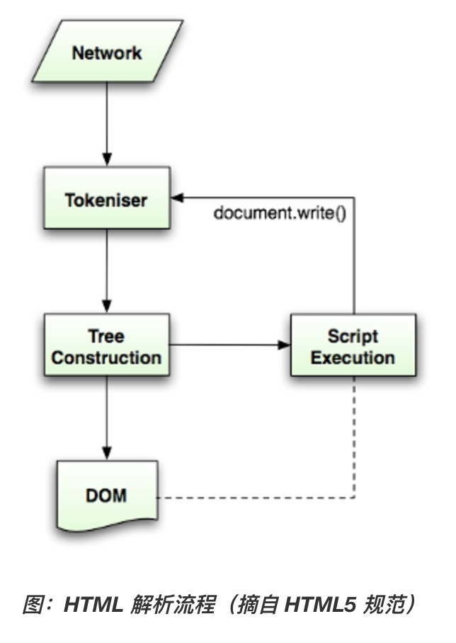
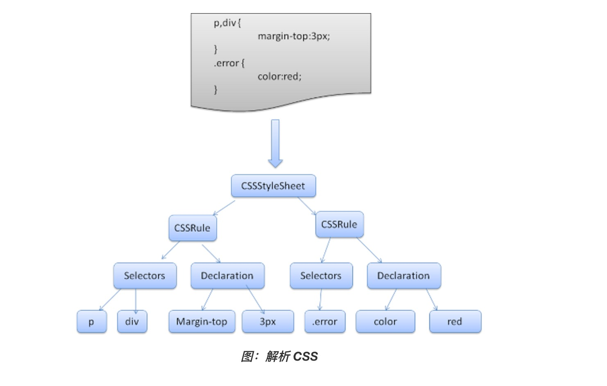

#  webkit技术内幕笔记和浏览器渲染过程

* 资源的缓存机制是提高使用效率的有效方法。他的基本思想是建立一个资源的缓存池，当Webkit需要请求资源的时候，先从资源池中查找是否存在相应的资源，如果有则会从资源池中取出直接使用，如果没有，则会发送真正的请求给服务器，并且把资源缓存起来。这里的缓存指的是内存缓存。
* 根据cookie的时效性可以将cookie分成两种类型，一个是会话型Cookie（session cookie），这些cookie只是保存在内存中，当浏览器退出的时候即清楚这些cookie。如果cookie没有设置失效时间 ，就是会话型cookie。第二种是持续型cookie，就是当浏览器退出的时候，仍保留cookie的内容，这种类型的cookie有一个有效期，在有效期内，每次访问该cookie所属域时，都需要将该cookie发送给服务器，这样服务器可以能够有效的追踪用户的行为
* DNS预取和TCP预连接，DNS预取的主要思想是利用现有的DNS机制，提前解析网页中可能的网络连接。当用户在浏览页面的时候，可能会提取页面内的超链接，将域名抽取出来，利用较少的CPU和网络带宽来解析这些域名和或IP地址
* 网页开发者，可以从以下方面着手改变以减少因为DNS和TCP连接占用的大量时间

    * 减少链接的重定向，会导致多次的DNS解析，并且也会阻碍DNS预取技术的应用
    * 利用DNS预取机制，可以在开发过程中，制定需要预取的URL
    * 避免错误的链接请求
    * 在HTML页面中内嵌小型的资源
    * 合并一些资源
    * 使用浏览器本地磁盘缓存机制
    * 启用资源的压缩技术

## HTML解释器和DOM模型
* DOM的全称是文档对象模型，
* WebKit内部对网页内容在各个阶段的结构表示：首先是字节流，经过解码之后形成字符流，然后经过词法分析器会被解释成词语，之后经过语法分析器构建成节点，最后这些节点被组建成一棵DOM树。Bytes->Characters->tokens->nodes->DOM Tree
* 在WebKit中，网络资源的字节流自IO线程传递给渲染线程之后，后面的解释 布局和渲染等工作基本上是在该线程，也就是在渲染线程上完成的。因为DOM树只能在渲染线程上创建和访问
* 事件捕获和事件冒泡，事件捕获是从上到下，事件冒泡是从下到上
* **shadow DOM**

## CSS解释器和样式布局
* CSS解释器和规则匹配处于DOM树建立之后，RenderObject树建立之前，CSS解释器解释后的结果会保存起来，然后RenderObject树基于该结果来进行规范匹配和布局计算。**当网页有用户交互或者动画等动作的时候，通过CSSOM等技术，Javascript代码同样也可以非常方便的修改CSS代码，这个时候WebKit需要重新解释样式并且重复以上的过程**
* CSSOM称为CSS对象模型。它的思想是在DOM中的一些节点接口中，加入获取和操作CSS属性或者接口的JavaScript接口，因而JavaScript可以动态操作CSS样式。DOM提供了接口让JS修改HTML文档，同理CSSOM提供了接口让JavaScript获得和修改CSS代码设置的样式信息。
* 当webkit创建RenderObject对象之后，每个对象是不知道自己的位置、大小等信息的，WebKit根据框模型来计算它们的位置、大小等信息的过程称为布局计算
* 布局计算是一个递归的过程，这是因为一个节点的大小通常需要先计算它的子女节点的位置和信息
* WebKit需要重新计算布局的情况：

    * 当网页首次被打开的时候，当可视区域发生变化的时候，WebKit都需要重新计算布局，因为网页的包含块的大小发生了改变
    * 网页的动画会触发布局计算，当网页显示结束后，动画可能改变样式属性，那么WebKit就需要重新计算
    * JavaScript代码通过CSSOM等接口直接修改样式信息
    * 用户的交互，例如翻滚页面，这会触发新区域布局的计算

## 渲染基础
* 对于“可视节点”，因为WebKit需要将它们的内容绘制到最终的网页结果中，所以webkit会为它们建立相对应的RenderObject对象，一个RenderObject对象保存了为绘制DOM节点所需要的各种信息，他们也构成一棵树，基于DOM树建立起来的一课新书，为乐布局计算和渲染等机制而构建的一种新的内部表示。
* RenderLayer树是基于RenderObject树建立起来的一棵新树，RenderLayer节点和RenderObject是一对多的关系
* **哪些情况下，RenderObject节点需要建立新的RenderLayer节点呢？**

## 浏览器的工作原理
呈现引擎开始解析HTML文档，并将各标记逐个转化成“内容树”上的DOM节点。同时也会解析外部CSS文件以及样式元素中的样式数据。HTML中这些带有视觉指令的样式信息将用于创建另一个书结构:RenderTree(呈现树)

呈现树包含多个带有视觉属性（如颜色和尺寸）的矩形，这些矩形的排列顺序就是他们将在屏幕上显示的顺序

呈现树构建完毕后，(Layout of the render tree),进入“布局”处理阶段，也就是为每个节点分配一个应出现在屏幕上的确切目标，下一个阶段是（paint）绘制，呈现引擎会遍历呈现树，由用户界面后端层将每个节点绘制出来。

这是一个渐进的过程，为达到更好的用户体验，呈现引擎会力求尽快的将内容显示在屏幕上，他不必等到整个HTML文档解析完毕之后，就会开始构建render tree 和设置布局，在不断接受和处理来自网络的其余内容的同时，render engine 会将部分内容解析并显示出来

## 浏览器的工作原理

### 浏览器的主要功能

主要功能就是向服务器发出请求，在浏览器窗口中展示您选择的网络资源。这里说的资源一般是指HTML文档，也可以是PDF、图片或其他的类型，资源的位置由用户使用URI(统一资源标识符)指定

### 浏览器的高层结构

* 用户界面
* 浏览器引擎 在用户界面和呈现引擎之间传送指令
* 呈现引擎 负责显示请求的内容，如果请求的是HTML，他就负责解析HTML和CSS内容，并将解析后的内容显示在屏幕上
* 网络 用于网络调用，比如HTTP请求。其接口与平台无关，并为所有平台提供底层实现
* 用户界面后端
* Javascript解释器 用于解析和执行JavaScript代码
* 数据存储 持久层，浏览器需要在硬盘上保存各种数据

### 呈现引擎

Firefox 使用的是Gecko Safari和Chrome使用的都是Webkit

**主流程**

呈现引擎将开始解析HTML文档，并将各标记逐个转化为"内容树"上的DOM节点，同时也会解析外部CSS文件以及央视元素中的样式数据，HTML中这些带有视觉指令的信息将用于创建另一个树结构：Render tree

RenderTree 完毕之后，进入布局处理阶段，也就是为每个节点分配一个应出现在屏幕上的确切坐标，下一个阶段是绘制，呈现引擎会遍历呈现树，由用户界面后端层将每个节点绘制出来

这个过程是一个渐进的过程，为了达到更好的用户体验，呈现引擎会力求将内容尽快显示在屏幕上，不必等到整个HTML文档解析完毕之后，就开始构建呈现树和设置布局，在不断接收和处理来自网络的其余内容的同时，呈现引擎也会讲部分内容解析并显示出来

### HTML5的解析算法

两个阶段组成： 标记化和树构建

标记化是词法分析过程，将输入内容解析成多个标记，HTML标记包括起始标记、结束标记、属性名称和属性值

标记生成器识别标记，传递给树构造器，然后接受下一个字符以识别下一个标记，如此反复直到输入的结束

### CSS解析器

### 处理脚本和样式表的顺序

**脚本**

网络的模型是同步的，当遇到了script标记时立即解释执行脚本，文档的解析将停止，知道脚本执行完毕。如果脚本时外部的，那么解析过程会停止，直到从网络同步抓取资源完成后再继续。也可以使用defer(不会停止文档解析而是等到解析结束了才执行)和async(由其他线程解析和执行)

**预解析**

在执行脚本时，其他线程会解析文档的其余部分，找出并加载需要通过网络加载的其他资源，通过这种方式，资源可以并行连接上加载，从而提高总体速度，预解析器不会修改DOM树，而是将这项工作交给主解析器处理，预解析器只会解析外部资源的引用

**样式表**

理论上，应用样式表不会更改DOM树，因此似乎没有必要等待样式表并停止文档解析。但这涉及到一个问题，就是脚本子啊文档解析阶段可能会请求样式信息，如果当时还没有加载和解析样式，容易出错，所以对于WebKit而言，仅当脚本尝试访问的样式属性可能受尚未加载的样式表影响时，它才会禁止该脚本，FF则是在样式表加载和解析的过程中，会禁止所有脚本

### 呈现树构建

在DOM树构建的同时，浏览器还会构建另一个树结构：RenderTree，这是由可视化元素按照其显示顺序而组成的树，也是文档的可视化表示

**呈现树和DOM树的关系**

呈现器是和DOM元素相对应的，但并非一一对应，非可视化的DOM元素不会插入呈现树中(display:none不会visibility:hidden会)

### 布局

呈现器在创建完成并添加到呈现树时，并不包含位置和大小信息。计算这些值的过程称为布局和重排

HTML采用基于流的布局模型，这意味着大多数情况下只要一次便利就能计算出几何信息，处于流中靠后位置元素通常不会影响靠前位置元素的几何特征，因此布局可按从左至右、从上至下的顺序遍历文档（表格的计算除外）

布局是一个递归的过程，从根呈现器(对应于HTML文档的<html>元素)开始，然后递归遍历部分或所有的框架层次结构，为每一个需要计算的呈现器计算几何信息

### Dirty 位系统

为避免对所有细小更改都进行整体布局，浏览器采用了一种"dirty位"系统，如果某个呈现器发生了更改，或者将自身及其子代标注为"dirty"，则需要进行布局

### 全局布局和增量布局

全局布局是指触发了整个呈现树范围的布局：
    
* 影响所有呈现器的全局样式修改，例如字体大小修改
* 屏幕大小调整

布局可以采用增量方式，也就是只对 dirty 呈现器进行布局（这样可能存在需要进行额外布局的弊端）。 
当呈现器为 dirty 时，会异步触发增量布局。例如，当来自网络的额外内容添加到 DOM 树之后，新的呈现器附加到了呈现树中。

### 绘制

在绘制阶段，系统会遍历呈现树，并调用呈现器的"paint"方法，将呈现器的内容显示在屏幕上

**全局绘制和增量绘制**

和布局一样，绘制也分为全局（绘制整个呈现树）和增量两种。在增量绘制中，部分呈现器发生了更改，但是不会影响整个树。更改后的呈现器将其在屏幕上对应的矩形区域设为无效，这导致 OS 将其视为一块“dirty 区域”，并生成“paint”事件。OS 会很巧妙地将多个区域合并成一个。在 Chrome 浏览器中，情况要更复杂一些，因为 Chrome 浏览器的呈现器不在主进程上。Chrome 浏览器会在某种程度上模拟 OS 的行为。展示层会侦听这些事件，并将消息委托给呈现根节点。然后遍历呈现树，直到找到相关的呈现器，该呈现器会重新绘制自己（通常也包括其子代）。

**绘制顺序**

绘制的顺序其实就是元素进入*堆栈样式上下文*的顺序，这些堆栈会从后往前绘制。块呈现器的堆栈顺序如下：

* 背景颜色
* 背景图片
* 边框
* 子代
* 轮廓

    

