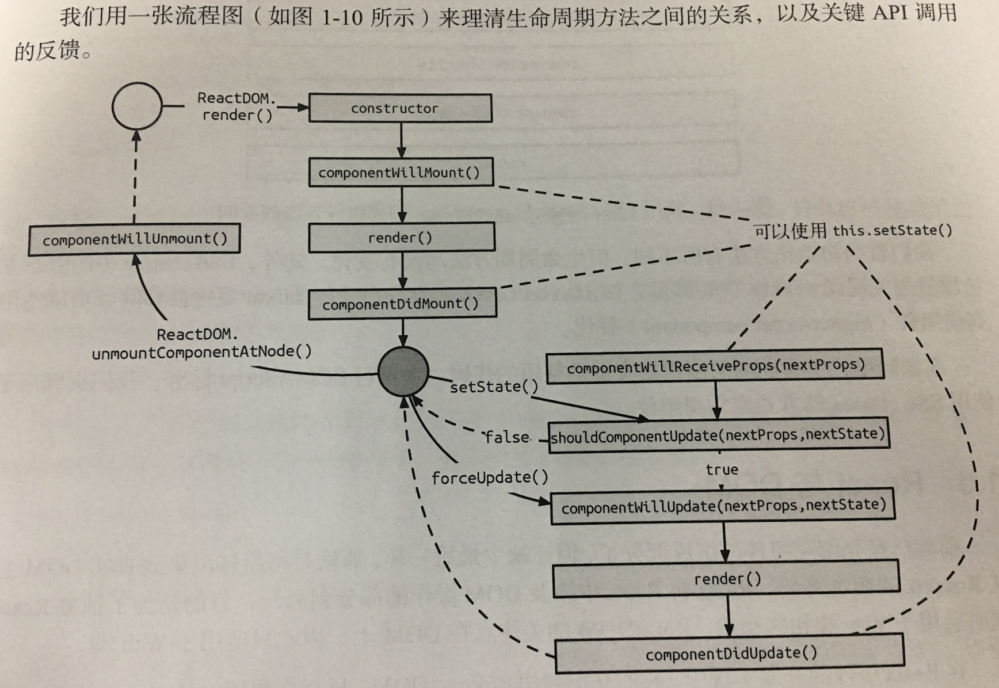

# React Summary

## React 的简介
React把用户界面抽象成一个个组件，开发者通过组合这些组件，最终得到功能丰富、可交互的页面。通过引入JSX语法，复用组件变得容易，同时也能保证组件结构清晰，JSX最大的好处就是对Virtual DOM的集合。

React不仅专注于View层的问题，也是一个包括view和controller的库，对于复杂的场景可以自己选择业务层框架。

DOM操作十分昂贵，性能消耗最大的就是DOM操作，而且这部分代码不好维护，React把真实DOM树转换成JavaScript对象树(virtual dom)，每次数据更新后，重新计算Virtual DOM 并和上一次的做比较，对发生变化的部分进行批量更新。React 提供了shouldComponentUpdate生命周期回调函数，来减少不必要的对比过程达到优化。有人说因为虚拟DOM 大大的提升了 React 性能。其实不然，我觉得虚拟DOM的渲染方式，跟传统DOM操作也许会好一点，但是好的并不会非常明显，因为对比DOM节点也是需要计算资源的。

虚拟DOM最大好处在于方便的跟其他平台的集成，比如 react-native 就是基于虚拟DOM，然后渲染出了原生控件，因为react组件可以映射为对应的原生控件。在输出的时候，是输出html DOM，还是安卓控件，还是IOS控件，这是由平台决定了。

React在设计的时候带有函数式编程的基因，因为React组件本身就是纯函数，React的createElemet方法保证了组件是纯净的，即传入指定props得到一定的Virtual DOM,整个过程都是可预测的。

## React 组件
React组件基本上由三个部分组成---属性(props)、状态(state)以及生命周期方法。React组件即为组件元素。组件元素被描述为纯粹的JSON对象，意味着可以使用方法或是类来创建。


React 组件的构建方法

```
// 1. React.createClass，最传统，兼容性最好的方法
    const Button = React.createClass({
        getDefaultProps() {
            // ...
        }
        
        render() {
            return { // ... }
        }
    })
    
// 2. ES6 classes
    import React, { Component } from 'react';
    
    class Button extends Component {
        constructor(props) {
            super(props)
        }
    
        static props = {
    
        }
        
        render() {
            return {
                // ...
            }
        }
    }
// 3. 无状态函数,使用无状态函数构建的组件称为无状态组件，推崇
        function Button({ color = 'blue', text = 'text' }) {
        return (
            <button className={`btn btn-${color}`}>
                {text}
            </button>
        )
    }
    
```
## React 数据流
React中，数据是自顶向下单向流动的，即从父组件到子组件

state和props的概念。如果顶层组件初始化props，那么React会向下遍历整颗组件树，重新尝试渲染所有相关的子组件。而state只关心每个组件自己内部的状态，这些状态只能在组件内改变。把组件看成一个函数，那么它接受了props作为参数，内部由state作为函数的内部参数，返回一个Virtual DOM的实现

React的单向数据流主要的流动通道就是props,props本身是不变的。组件的props一定来自于默认属性或通过父组件传递而来的。

propTypes 用于规范props的类型与必须的状态。如果组件定义了PropTypes,那么在开发环境下，就会对组件的props值的类型作检查。

## React 的生命周期
React组件的生命周期根据广义定义描述：可以分为挂载、渲染和卸载这几个阶段。当渲染后的组件需要更新时，我们会重新去渲染组件，直到卸载。
生命周期分为两类：

* 当组件在初始化或卸载时
* 当组件接收新的数据时，即组件更新时

初始化：

```
// 读取初始 state props 以及两个组件生命周期的方法，只会在组件初始化时运行一次
// 如果在componentWillMount 执行setState方法，会发生？组件会更新state，但组件只渲染一次，无意义的行为
// 如果在componentDidMount 执行setState方法，会发生?会再次渲染组件
import React, { Component } from 'react'

class App extends Component {
    static propTypes = {

    }

    static defaultProps {

    }

    constructor(props) {
        super(props)
        this.state = {

        }
    }

    componentWillMount() {
        // ...
    }

    componentDidMount() {
        // ...
    }

    render() {
        return // ...
    }
}
```
卸载：

```
// 常常执行一些清理方法，事件回收或是清楚定时器
import React, { Component } from 'react'

class App extends Component {

    componentWillUnmount() {
        // ...
    }

    render() {
        return // ...
    }
}
```

数据更新过程

```
// 数据更新过程指的是父组件向下传递props或者组件自身执行了setState方法时发生的一系列更新性动作
import React, { Component } from 'react'

class App extends Component {

   componentWillReceiveProps(nextProps) {
       // ...
   }

    // 本质是用来进行正确的组件渲染
   shouldComponentUpdate(nextProps, nextState) {
       // ...
   }
    // 不能调用setState方法
   componentWillUpdate(nextProps, nextState) {
       // ...
   }

   componentDidUpdate(prevProps, prevState) {
       // ...
   }

    render() {
        return // ...
    }
}
```


## React 与 DOM
React将React中涉及到的DOM操作已经剥离开，目的是为了抽象React,同时适用web端和移动端

* findDOMNode
* render
* unmountComponentAtNode 进行卸载操作
* unstable_renderSubTreeIntoContainer 作用是更新组件到传入的DOM节点上，使用它完成组件内实现跨组件的DOM操作。

```
获取真实的DOM节点
    findDOMNode
    refs
```
## 事件系统
Virtual DOM 在内存中是以对象的形式存在的，如果想要在这些对象上添加事件，就会非常简单。React基于Virual DOM实现了一个SyntheticEvent层，我们所定义的事件处理器会接收到一个SyntheicEvent实例。

合成事件的实现机制

* 事件委派
    
    它不会把事件处理函数直接绑定到真实的节点上，而是把所有事件绑定到结构的最外层，然后使用一个统一的事件监听器，这个事件监听器上维持了一个映射来保存所有组件内部的事件监听和处理函数。当组件挂载或卸载时，只是在这个统一的事件监听器上插入或删除一些对象，当事件发生时，首先被这个统一的事件监听器处理，然后在映射里面找到真正处理函数调用。这样建华了事件处理和回收机制，效率提升。
    
* 自动绑定

    在React组件中，每个方法的上下文都会指向该组件的实例，即自动绑定this为当前组件，并且React会对这种引用进行缓存，达到优化。但是使用ES6 class和无状态函数时，需要手动绑定。方法有:`bind方法` 、`构造器内声明`、`箭头函数`
    
原生事件和React事件可能会带来一些影响，解决方法：

* 不要将合成事件与原生事件混用
* 通过e.target判断来避免

并且阻止React内部事件冒泡的行为(reactevent.nativeEvent.stopPropagation)没办法阻止原生事件的冒泡，而原生事件中的组织冒泡可以组织React合成事件的传播

React合成事件与JavaScript原生事件的对比：

* 事件传播与组织事件传播，浏览器是先捕获再目标对象本身的事件处理再冒泡，而低于IE9版本的IE只支持冒泡，所以React的合成事件仅仅支持了事件冒泡机制
* 事件类型，React合成事件的事件类型是JavaScript原生事件的子集
* 事件绑定方式，受到不同的标准DOM的影响，有三种方式进行事件绑定，而React合成事件只有一种
* 事件对象，原生DOM事件对象在W3C标准和IE标准下存在差异，在低版本的IE浏览器中，只能使用window.event来获取事件对象，而在React合成事件系统中，不存在兼容性的问题

## React中的样式处理

CSS模块化的解决方案主要的两种：

* Inline Style,这种方案彻底抛弃CSS，使用JavaScript或JSON来写样式，能给CSS提供JavaScript同样强大的模块化能力。但是缺点很明显，Inline Style几乎不能利用CSS本身的特性，媒体查询等，伪类处理也很复杂，必须依赖对应的框架
* CSS Modules，依旧使用CSS，但使用JavaSCript来管理样式的依赖

    css模块化，解决了平时的css所带来的一些问题
    
    *  全局污染
    CSS 使用全局选择器机制来设置样式，优点是方便重写样式。缺点是所有的样式都是全局生效，样式可能被错误覆盖，因此产生了非常丑陋的 `!important`，甚至 inline `!important` 和复杂的[选择器权重计数表](Selectors Level 3)，提高犯错概率和使用成本。Web Components 标准中的 Shadow DOM 能彻底解决这个问题，但它的做法有点极端，样式彻底局部化，造成外部无法重写样式，损失了灵活性。
    
    *  命名混乱
    
    由于全局污染的问题，多人协同开发时为了避免样式冲突，选择器越来越复杂，容易形成不同的命名风格，很难统一。样式变多后，命名将更加混乱。
    
    *  依赖管理不彻底
    
    组件应该相互独立，引入一个组件时，应该只引入它所需要的 CSS 样式。但现在的做法是除了要引入 JS，还要再引入它的 CSS，而且 Saas/Less 很难实现对每个组件都编译出单独的 CSS，引入所有模块的 CSS 又造成浪费。JS 的模块化已经非常成熟，如果能让 JS 来管理 CSS 依赖是很好的解决办法。Webpack 的 `css-loader` 提供了这种能力。
    
    *  无法共享变量
    
    复杂组件要使用 JS 和 CSS 来共同处理样式，就会造成有些变量在 JS 和 CSS 中冗余，Sass/PostCSS/CSS 等都不提供跨 JS 和 CSS 共享变量这种能力。
    
    * 代码压缩不彻底
    
    由于移动端网络的不确定性，现在对 CSS 压缩已经到了变态的程度。很多压缩工具为了节省一个字节会把 '16px' 转成 '1pc'。但对非常长的 class 名却无能为力，力没有用到刀刃上。
    
## 组件间通信
* 父组件向子组件通信
    
    父组件通过props向子组件传递需要的信息
    
* 子组件向父组件通信

    1. 利用回调函数
    2. 利用自定义事件机制
    
* 跨级组件通信

    当需要让子组件跨级访问信息时，我们可以像之前说的方法那样向更高级别的组件层层传递props，但此时的代码显得不那么优雅，甚至有些冗余,在React中，我们还可以使用context来实现跨级父子组件间的通信
    
    ```
    class ListItem extends Component {
        static contextTypes = {
            color: PropTypes.string,
        }
    
        render() {
            cons { value } = this.props
    
            return (
                <li style={{ backgroundColor: this.context.color }}>{value}</li>
            )
        }
    }
    
    class List extends Component {
        static childContextTypes = {
            color: 'red'
        }
    
        getChildContext() {
            return {
                color: 'red'
            }
        }
        
        render() {
            return (
                //... 未传入color在props中
            )
        }
    }
    ```
    在父组件中定义了ChildContext，这样从这一层开始的子组件都可以拿到定义的context
    
    context一直存在在React的源码中，尽管它可以减少逐层传递，但是组件结构复杂的时候，不知道context从哪里传来的，Context就像是一个全局对象，会造成混乱，所以大部分情况下不推荐使用，context的使用场景是真正意义上的全局信息且不会更改

* 没有嵌套关系的组件通信
    
    常用事件机制去做，或者是第三方库文件
    
## 组件间抽象
* 通过mixin的方式（可以通过decorator来实现）

    带来的问题：
       
    * 破坏了原有组件的封装

        mixin会混入方法，给原有组件带来了新的特性，但是也会带来新的props和state，意味着组件有一些"不可见"的状态需要我们去维护，但我们在使用的时候并不清楚，再者就是很容易造成mixin链的情况
        
    * 命名冲突

        mixin师哥平面结构，那么不同mixin中的命名在不可知的情况下，重用的可能性是不可控的
        
    * 增加复杂性

        因为不断的加入新状态，会造成组件的复杂度

* 高阶组件(取代mixin)
    
    实现高阶组件的两种方式：
    
    * 属性代理，高阶组件通过被包裹的React组件来操作props

        ```
        const MyContainer = (WrappedComponent) => 
            class extends Component {
                render() {
                    return < WarppedComponent {...this.props} />
                }
            }
        ```
        
    * 反向代理，高阶组件继承于被包裹的React组件

        ```
        const MyContainer = (WrappedComponent) => 
            class extends WrappedComponent {
                render() {
                    return super.render()
                }
            }
            
        ```
    
## 组件性能优化
    
* Immutable Data 就是一旦创建，就不能再更改的数据。对Immutable对象进行修改、添加或删除操作，都会返回一个新的Immutable对象，Immutable实现的原理就是持久化的数据结构，也就是使用旧数据创建新数据时，要保证旧数据同时可用且不变。同时为了避免深拷贝把所有的节点都复制一遍的性能损耗，Immutable使用了结构共享，即如果对象数中一个节点变化，只修改这个节点和受它影响的父节点，其他节点则共享
        
 Immutable的优点：
      * 降低了可变带来的复杂度
      * 节省内存
      * 撤销／重做，复制／粘贴，甚至事件旅行这些功能做起来都是小菜一碟
      * 并发安全
      * 拥抱函数式编程，只要输入一致，那么输出必然一致
      
利用Immutable（=== 和 is 来比较就能知道是否需要执行render）来进行组件的性能优化

```
import React, { Component } from 'react'
import { is } from 'immutable'

class App extends Component {
    shouldComponentUpdate(nextProps, nextState) {
        const thisProps = this.props || {}
        const thisState = this.state || {}

        if(Object.keys(thisProps).length !== Object.keys(nextProps).length || 
           Object.keys(thisState).length !== Object.keys(nextState).length) {
               return true;
           }
        
        for(const key in nextProps) {
            if(thisProps[key] !== nextProps[key] || 
              !is(thisProps[key], nextProps[key])) {
                  return true;
              }
        }

        for(const key in nextState) {
            if(thisState[key] !== nextState[key] || 
              !is(thisState[key], nextState[key])) {
                  return true;
              }
        }

        return false;

    }
}
```
* React建议把this.state当作不可变的，因此修改前需要做一个深拷贝
* 写动态子组件的时候，需要给动态子项添加key prop，用来标识当前项的唯一性props

## 自动化测试
* Enzyme
    
    Enzyme提供三种不同的方式来测试组件
    
    * shallow: 推荐的方式，浅渲染，只会渲染本组件内容，引用的外部组件不会渲染，提供更多好的隔离性
    * render: 如果shallow不能满足，才会使用它。基于Cheerio来模拟DOM环境
    * mount: 类似render,会做全渲染，对于测试生命周期时非常有用
    
    [Enzyme](https://github.com/airbnb/enzyme)

## 解密setState机制
* setState异步更新
    
    setState通过一个队列机制来实现state更新。当执行setState时，会将需要更新的state合并后放入状态队列，而不会立刻更新this.state，队列机制可以高效地批量更新state。如果不通过setState来直接修改this.state的值，那么该state将不会被放入状态队列中，当下次调用setState并对状态队列进行合并时，将会忽略之前直接被修改的state，而造成无法预知的错误
    
* setState循环调用风险

    调用setState时，实际上会执行enqueueSetState方法，并对partialState以及_pendingStateQueue更新队列进行合并操作，最终通过enqueueUpdate执行state更新
    
    而performUpdateIfNecessary方法会获取_pendingElement、_pendingStateQueue _pendingForceUpdate 并调用receiveComponent 和 updateComponent方法进行组件更新
    
    如果在shouldComponentUpdate或componentWillUpdate方法中调用setState，此时this._pendingStateQueue != null 则performUpdateIfNecessary会调用updateComponent，而updateComponent会调用shouldComponentUpdate和componentWillUpdate,所以会造成循环调用，使得浏览器崩溃。

* setState调用栈

    ```
    this.setState(newState)
            |
    newState 存入 pending队列
            |
    调用enqueueUpdate
            |
    是否处于批量更新模式
        |是      |否
    将组件保存到  遍历dirtyComponents 调用updateComponents 
    dirtyComponents             更新pending state props
    ```
## diff算法
diff作为Virtual DOM的加速器，其算法上的改进优化是React整个界面渲染的基础和性能保障，Virtual DOM模型和diff的完美结合。

diff策略：

* Web UI中DOM节点跨层级的移动操作特别少，可以忽略不计
* 拥有相同类的两个组件将会生成相似的树形结构，拥有不同类的那个组件将会生成不同的属性结构
* 对于同一层级的一组节点，他们可以通过唯一的id进行区分

**tree diff**

基于策略一，React对树进行分层比较，两棵树只会对同一层次的节点进行比较

**component diff**

React是基于组件构建应用的，对于组件间的比较所采取的策略也是非常简洁、高效的。

* 如果是同一类型的组件，按照原策略继续比较Virtual DOM树
* 如果不是，将该组件判断为dirty component 从而替换整个组件下的所有节点
* 对于同一类型的组件，有可能其Virtual DOM没有任何变化，如果能知道这点，也可以节省大量的diff时间，可以通过shouldComponentUpdate()来判断

**element diff**

当节点处于同一层级时，diff提供了3种节点操作，分别为INSERT_MARKUP(插入)、MOVE_EXISTING(移动)和REMOVE_NODE(删除)

允许开发者对同一层级的同组子节点，添加卫衣的key进行区分，进行性能优化

diff的运作方法：

首先，对新集合中的节点进行循环遍历，通过唯一的key判断新旧集合中是否存在相同的节点，如果存在相同节点，则进行移动操作，但在移动前需要将当前节点在旧集合中的位置与lastIndex进行比较if(child._mountIndex < lastIndex),否则不执行操作，这是一种顺序优化手段，因为靠后的元素对整体的元素影响较小

## React Patch方法

Patch 简而言之就是将tree diff计算出来的DOM差异队列更新到真实的DOM节点上，最终让浏览器能渲染出更新的数据。

实现主要是通过遍历差异队列实现的，遍历差异队列时，通过更新类型进行相应的操作，包括：新节点的插入，也有节点的移动和移除

为什么可以直接依次插入节点呢？原因是在diff阶段添加差异节点到差异队列时，本身就是有序添加。也就是说，新增节点(move/insert)在队列里的顺序就是最终真实DOM的顺序，因此可以直接依次根据index去插入节点，React时计算出全部差异并放入差异队列中，在一次性的去执行Patch方法完成DOM的更新

## Redux 高阶应用

## Recat服务端渲染


## 链接
[JSX的好处](https://github.com/eyasliu/blog/issues/12)


