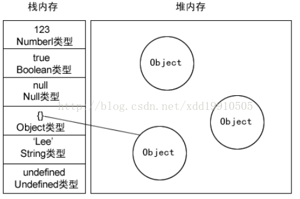

# C/C++中的栈和堆

* 栈区，有编译器自动释放，存放函数的参数值，局部变量的值等。操作方式类似于数据结构中的栈
* 堆区，一般由程序员分配释放，若程序员不释放，程序结束时，kennel有os回收。分配方式类似于链表
* 全局区，全局变量和静态变量的存储是放在一起的，初始化的全剧变量和静态变量在一块区域，未初始化的全局变量和未初始化的静态变量在相邻的一块区域。
* 文字常量区，常量字符串放在这
* 程序代码区，存放函数体的二进制代码

```
  //main.cpp    
  int   a   =   0;   //全局初始化区    
  char   *p1;   //全局未初始化区    
  main()    
  {    
  int   b;   //栈    
  char   s[]   =   "abc";   //栈    
  char   *p2;   //栈    
  char   *p3   =   "123456";   //123456/0在常量区，p3在栈上。    
  static   int   c   =0；   //全局（静态）初始化区    
  p1   =   (char   *)malloc(10);    
  p2   =   (char   *)malloc(20);    
  //分配得来得10和20字节的区域就在堆区。    
 // strcpy(p1,   "123456");   123456/0放在常量区，编译器可能会将它与p3所指向的"123456"     
  }    
```

* 申请方式：
    * stack：由系统自动分配，eg:在函数中声明一个局部变量
    * heap: 需要程序员自己申请，并指明大小，在c中malloc函数,C++中用new运算符  
* 申请后系统的响应
    * 栈：只要栈的剩余空间大于所申请空间，系统将为程序提供内存，否则将报异常提示栈溢出
    *   堆：首先应该知道操作系统有一个记录空闲内存地址的链表，当系统收到程序的申请时会遍历该链表，寻找第一个空间大于所申请空间的堆结点，然后将该结点从空闲结点链表  中删除，并将该结点的空间分配给程序，另外，对于大多数系统，会在这块内存空间中的首地址处记录本次分配的大小，这样，代码中的delete语句才能正确的释放本内存空间。另外，由于找到的堆结点的大小不一定正好等于申请的大小，系统会自动的将多余的那部分重新放入空闲链表中。
* 申请大小的限制
    * 栈：在Windows下,栈是向低地址扩展的数据结构，是一块连续的内存的区域。这句话的意思是栈顶的地址和栈的最大容量是系统预先规定好的，在WINDOWS下，栈的大小是2M（也有 的说是1M，总之是一个编译时就确定的常数），如果申请的空间超过栈的剩余空间时，将提示overflow。因此，能从栈获得的空间较小。
    * 堆：堆是向高地址扩展的数据结构，是不连续的内存区域。这是由于系统是用链表来存储的空闲内存地址的，自然是不连续的，而链表的遍历方向是由低地址向高地址。堆的大小受限于计算机系统中有效的虚拟内存。由此可见，堆获得的空间比较灵活，也比较大
* 申请效率的比较
    * 栈由系统自动分配，速度较快。但程序员是无法控制的
    * 堆是由new分配的内存，一般速度比较慢，而且容易产生内存碎片,不过用起来最方便
* 堆和栈中的存储内容 
    * 栈：   在函数调用时，第一个进栈的是主函数中后的下一条指令（函数调用语句的下一条可执行语句）的地址，然后是函数的各个参数，在大多数的C编译器中，参数是由右往左入栈的，然后是函数中的局部变量。注意静态变量是不入栈的当本次函数调用结束后，局部变量先出栈，然后是参数，最后栈顶指针指向最开始存的地址，也就是主函数中的下一条指令，程序由该点继续运行。
    * 堆：一般是在堆的头部用一个字节存放堆的大小。堆中的具体内容由程序员安排

# JS中的栈和堆
* 基本类型就是保存在栈内存中的简单数据段，而引用类型指的是那些保存在堆内存中的对象。
* 基本类型有Undefined、Null、Boolean、Number 和String。这些类型在内存中分别占有固定大小的空间，他们的值保存在栈空间，我们通过按值来访问的
* 引用类型，值大小不固定，栈内存中存放地址指向堆内存中的对象。是按引用访问的。如下图所示：栈内存中存放的只是该对象的访问地址，在堆内存中为这个值分配空间。由于这种值的大小不固定，因此不能把它们保存到栈内存中。但内存地址大小的固定的，因此可以将内存地址保存在栈内存中。 这样，当查询引用类型的变量时， 先从栈中读取内存地址， 然后再通过地址找到堆中的值。对于这种，我们把它叫做按引用访问
* 
* 栈内存和堆内存之分
        
        通常与垃圾回收机制有关。为了使程序运行时占用的内存最小。
        当一个方法执行时，每个方法都会建立自己的内存栈，在这个方法内定义的变量将会逐个放入这块栈内存里，随着方法的执行结束，这个方法的内存栈也将自然销毁了。因此，所有在方法中定义的变量都是放在栈内存中的；
        当我们在程序中创建一个对象时，这个对象将被保存到运行时数据区中，以便反复利用（因为对象的创建成本通常较大），这个运行时数据区就是堆内存。堆内存中的对象不会随方法的结束而销毁，即使方法结束后，这个对象还可能被另一个引用变量所引用（方法的参数传递时很常见），则这个对象依然不会被销毁，只有当一个对象没有任何引用变量引用它时，系统的垃圾回收机制才会在核实的时候回收它
        
# JS中的垃圾回收
* 标记清除，这是JavaScript最常见的垃圾回收方式，当变量进入执行环境的时候，比如函数中声明一个变量，垃圾回收器将其标记为“进入环境”，当变量离开环境的时候（函数执行结束）将其标记为“离开环境”。至于怎么标记有很多种方式，比如特殊位的反转、维护一个列表等，这些并不重要，重要的是使用什么策略，原则上讲不能够释放进入环境的变量所占的内存，它们随时可能会被调用的到。垃圾回收器会在运行的时候给存储在内存中的所有变量加上标记，然后去掉环境中的变量以及被环境中变量所引用的变量（闭包），在这些完成之后仍存在标记的就是要删除的变量了，因为环境中的变量已经无法访问到这些变量了，然后垃圾回收器相会这些带有标记的变量机器所占空间。
* 引用计数(低版本的IE)，在低版本IE中经常会出现内存泄露，很多时候就是因为其采用引用计数方式进行垃圾回收。引用计数的策略是跟踪记录每个值被使用的次数，当声明了一个变量并将一个引用类型赋值给该变量的时候这个值的引用次数就加1，如果该变量的值变成了另外一个，则这个值得引用次数减1，当这个值的引用次数变为0的时候，说明没有变量在使用，这个值没法被访问了，因此可以将其占用的空间回收，这样垃圾回收器会在运行的时候清理掉引用次数为0的值占用的空间。
    
 看起来也不错的方式，为什么很少有浏览器采用，还会带来内存泄露问题呢？主要是因为这种方式没办法解决循环引用问题。比如对象A有一个属性指向对象B，而对象B也有有一个属性指向对象A，这样相互引用
 

